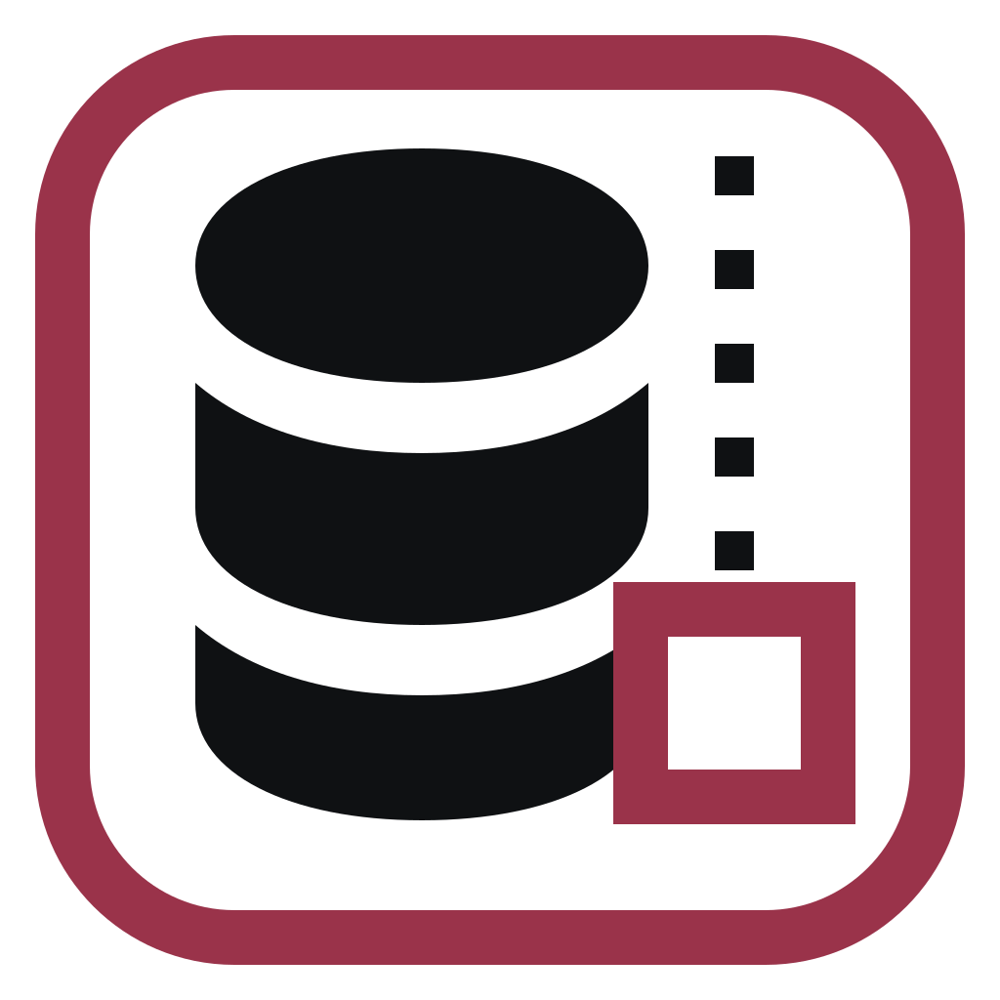
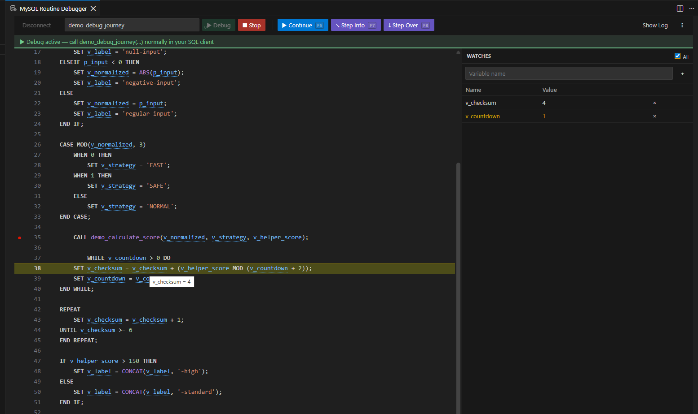

<h1> MySQL Routine Debugger</h1>

Debug MySQL and MariaDB stored procedures and functions with breakpoints, stepping, watches, variable inspection, and execution logs.

[](docs/images/vscode_mysql_debugger.png)

*A routine paused in the Visual Studio Code frontend. Click the image to view it at full size.*

> [!CAUTION]
> **Early alpha software:** this project has undergone only limited testing. Features may be incomplete, behavior may change without notice, and defects may affect database objects or data. Do not use it with production databases. Use only isolated development or test environments and ensure you have current backups.

Issue reports and help with collaborative testing are very welcome. If you try the debugger, please [open an issue](https://github.com/rk22-projects/mysql-routine-debugger/issues) to share problems, suggestions, or successful test results. Every constructive report helps make the project safer and more useful.

> [!WARNING]
> Use the debugger only on development or test databases. The connected account must have the required routine and schema privileges.

## Frontends

The debugger is available through three frontends. See the frontend-specific README for installation and usage instructions:

- [Visual Studio Code extension](vscode/README.md)
- [Apache NetBeans plugin](netbeans/README.md)
- [Standalone JavaFX application](standalone/README.md)

## Compatibility

Compatibility work targets modern MySQL and MariaDB releases, but not every server version, SQL mode, authentication configuration, or routine syntax has been verified yet.

## Quick start

1. Open your preferred frontend and connect to a development or test database.
2. Select a stored procedure or function.
3. Add breakpoints and start the debug session.
4. Invoke the routine from a separate SQL client or application connection.
5. Inspect variables and watches when execution pauses.
6. Continue, step into, step over, step out, or stop the session.

Use **Reset All Debug Changes** if an earlier session did not close normally.

## Project layout

```text
core/        Shared database and debugger logic
netbeans/    Apache NetBeans frontend
standalone/  JavaFX frontend
vscode/      Visual Studio Code frontend
docs/        Documentation images and supporting files
```
