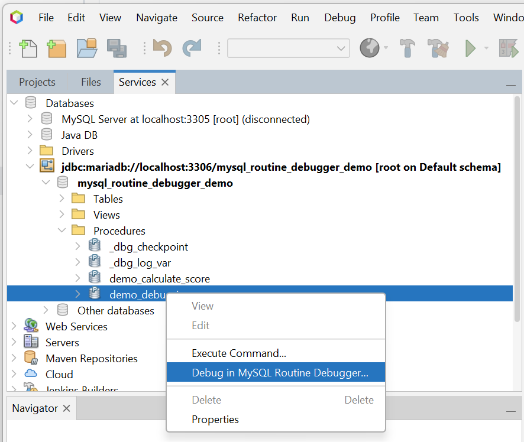
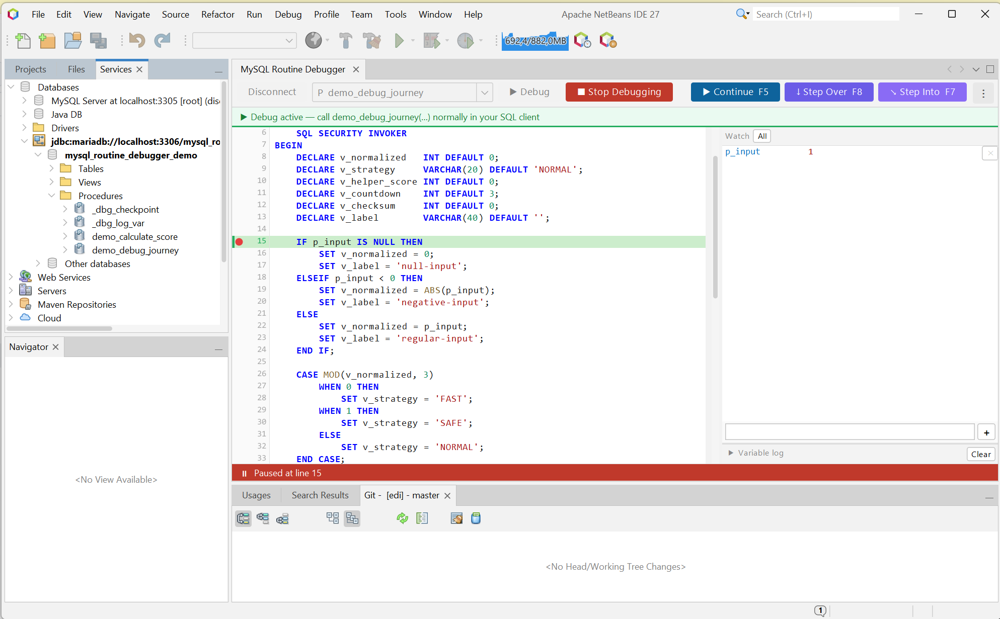

# Using MySQL Routine Debugger in Apache NetBeans

This guide covers the complete Apache NetBeans workflow. See the [plugin README](../../netbeans/README.md) for requirements and installation.

## Open the debugger and connect

Use either of these entry points:

- Open **Window > MySQL Routine Debugger** and enter the host, port, user, password, and database/schema in the connection dialog. The ellipsis button beside the database field discovers schemas using the entered server credentials.
- In **Services > Databases**, expand a connected database, right-click a stored procedure or function, and select **Debug in MySQL Routine Debugger…**. The debugger opens the routine using a dedicated control connection, leaving the SQL connection available for invocation.



## Select a routine and add breakpoints

When opened manually, type in the routine field to filter procedures and functions, then select one to load its definition. When opened from Database Explorer, the selected routine loads automatically.

Click the gutter beside an executable source line to set or remove a breakpoint. You can also place the caret on a line and press `F9`. Blank lines, comments, and other non-executable lines cannot receive breakpoints. Breakpoints are retained for that routine.



## Start and control a session

1. Select **Debug**. The green banner confirms that the routine and its directly called routines are ready.
2. Invoke the routine normally from a separate SQL editor, client, or application connection. For example:

   ```sql
   CALL my_schema.my_procedure(42);
   SELECT my_schema.my_function(42);
   ```

3. When execution pauses, use the toolbar or keyboard:

   | Action | Shortcut | Behavior |
   |---|---:|---|
   | Continue | `F5` | Run until the next breakpoint or completion. |
   | Step Into | `F7` | Enter a called routine when available. |
   | Step Over | `F8` | Advance without opening a called routine. |
   | Step Out | `Ctrl+F7` | Finish the called routine and return to its caller. |

Step Into opens a child debugger tab for the called routine. The child tab provides Continue, Step Over, and Step Out; it closes when that routine completes and focus returns to the caller.

### Important behavior during debugging

- Invoke only one instance of the debugged call chain at a time. Concurrent invocations share the same debug state and are not supported.
- Pausing requires debugger checkpoints to commit database state. Do not use a debug run to validate transaction or rollback behavior.
- The SQL client that invoked the routine remains blocked while execution is paused. Continue, step, stop, or reset the session before closing that client.

## Inspect variables and logs

- Enter a parameter or local variable in the **Watch** field and select `+`.
- Right-click an identifier in the source and select **Add to Watch**.
- Select **All** to watch variables automatically after they first appear in the log.
- Changed values are highlighted after a pause. “Not yet seen” means no value has been recorded for that variable.
- Hover over an identifier whose value is known to see its current value.
- Expand **Variable log** to inspect recorded labels, variables, values, and breakpoint events. **Clear** removes log entries for the active session without removing breakpoints.

## Stop and recover

Select **Stop Debugging** before switching connections or closing the debugger. This ends the active session and unblocks a paused call.

If NetBeans or the connection ends unexpectedly, reconnect to the same schema. The debugger checks for an interrupted session, performs recovery, and reports the affected routines.

Use **Reset all debug changes…** from the overflow menu only when normal Stop or automatic recovery cannot clean up a session. Reset affects all debugger sessions in the connected schema.
