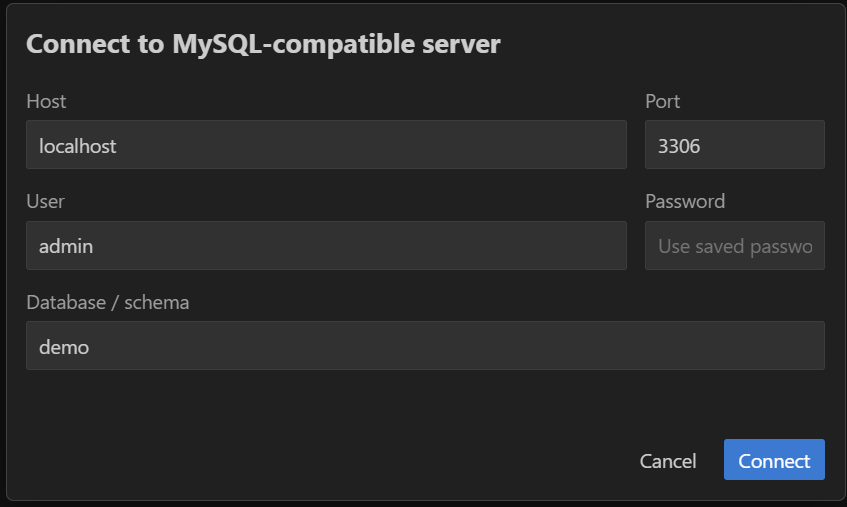

# Using MySQL Routine Debugger in Visual Studio Code

This guide covers the complete Visual Studio Code workflow. See the [extension README](../../vscode/README.md) for requirements and installation.

## Connect to a database

Run **MySQL Routine Debugger: Open Debugger** from the Command Palette, or select the debugger item in the status bar. Opening the panel displays the connection dialog when no connection is active.



Enter the host, port, user, password, and database/schema, then select **Connect**. The non-secret fields are retained in VS Code settings and passwords are stored in VS Code secret storage. Keep this connection open throughout the debugging session.

## Select a routine and add breakpoints

Type in the routine field to filter procedures and functions, or use its arrow to show every routine. Selecting a routine loads its definition in the source pane.

Set or remove a breakpoint by selecting an executable line's gutter, or place the pointer on the line and press `F9`. A red marker identifies a breakpoint. Blank lines, comments, and other non-executable lines cannot receive breakpoints. Breakpoints are retained for that routine.

## Start and control a session

1. Select **Debug**. The debugger prepares the selected routine and any directly called routines, and the green banner confirms that debugging is active.
2. From a separate SQL client or application connection, invoke the routine normally. For example:

   ```sql
   CALL my_schema.my_procedure(42);
   SELECT my_schema.my_function(42);
   ```

3. When execution reaches a breakpoint, the current line is highlighted. Use the toolbar or keyboard:

   | Action | Shortcut | Behavior |
   |---|---:|---|
   | Continue | `F5` | Run until the next breakpoint or completion. |
   | Step Into | `F7` | Enter a called routine when the current location supports it. |
   | Step Over | `F8` | Advance without opening a called routine. |
   | Step Out | `Ctrl+F7` | Finish the current called routine and return to its caller. |

Step Into appears only for the root routine and Step Out only while viewing a called routine. When stepping into a call, the source pane switches to that routine and returns to the caller after Step Out or completion.

[](../images/vscode_mysql_debugger.png)

### Important behavior during debugging

- Invoke only one instance of the debugged call chain at a time. Concurrent invocations share the same debug state and are not supported.
- Pausing requires debugger checkpoints to commit database state. Do not use a debug run to validate transaction or rollback behavior.
- The SQL client that invoked the routine remains blocked while execution is paused. Continue, step, stop, or reset the session before closing that client.

## Inspect variables and logs

- Add a parameter or local variable in the **Watches** input, or right-click an identifier in the source and add it to Watches.
- Select **All** to add variables automatically as their values appear in the log.
- Changed watch values are highlighted after a pause. A dash means that the variable has not been observed yet.
- Hover over a known identifier value in the source to see its current value.
- Select **Show Log** to display the chronological debug log. The log includes the routine, source label, variable, and value for each recorded event.
- Select **Clear** in the log panel to remove the current session's displayed and stored log entries. This does not remove breakpoints or stop debugging.

## Stop, disconnect, and recover

Select **Stop** before editing another routine, changing connections, or closing the debugger. Stop ends the active session and unblocks a paused call. Closing the debugger panel then closes its database connection.

If VS Code or the database connection ends unexpectedly, reconnect to the same schema. The debugger checks for an interrupted session, performs recovery, and reports the affected routines.

Use **Reset All Debug Changes** from the overflow menu only when normal Stop or automatic recovery cannot clean up a session. Reset affects all debugger sessions in the connected schema.
